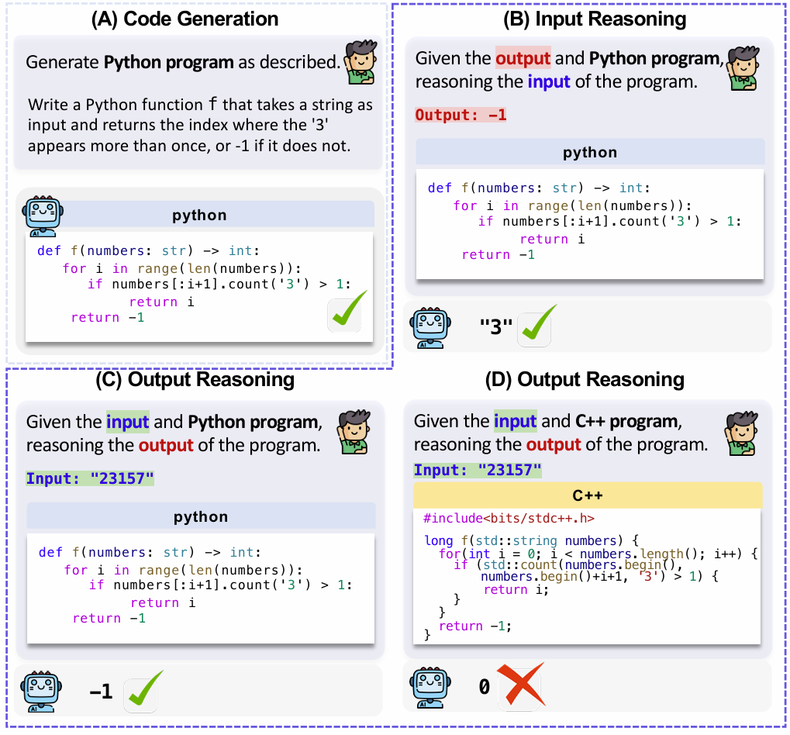

<p align="center">
<h1 align="center">CRUXEVAL-X: A Benchmark for Multilingual Code

 Reasoning, Understanding and Execution</h1>

<p align="center">
    <a href="https://huggingface.co/datasets/xhwl/cruxeval-x"></a>
    <a href="https://cruxeval-x.github.io/leaderboard.html"></a>
    <a href="https://arxiv.org/pdf/2408.13001"></a>
    <a href="https://benchmark.icip.org.cn/competitions/38/#/participate-tab"></a>
</p>

# Dataset Description
CRUXEVAL-X stands as a multi-lingual code reasoning benchmark, encompassing 19 programming languages and built upon the foundation of CRUXEVAL. This comprehensive resource features a minimum of 600 subjects per language, collectively contributing to a robust total of 19,000 content-consistent tests.

In this repository, we provide this dataset and the method to construct the benchmark.



# Usage
## Environment

### build image
```bash
cd ./docker
docker build -t cruxeval_x .
```
### run container
```bash
cd ./docker
bash run_docker.bash
docker exec -it cruxeval_x_env /bin/bash
```

## Benchmark Construction
before run the benchmark construction, you need to download the deepseekcoder-33b-instruct model to ./model, and replace "your api key", "your base url" and "your model name" with your own.

if you want to run the full pipeline
```bash
cd ./cruxeval-x
bash ./script/benchmark_construction.sh
```
if you want to run only one step, find the script for the specific step in ./script and run it.

## Dataset
all the dataset is in ./data, data dir start with "example" is the examples used for few-shot inferences. The final data is in ./data/cruxeval_preprocessed, which you can also download in 🤗 [hugging face](https://huggingface.co/datasets/xhwl/cruxeval-x).

the data is in the format of json, each line is a json object, the format is:
```json
{
    "id": "The id of each problem, which is in consistent with the cruxeval benchmark. Different languanges with the same id means the same problem.",
    "code": "The code which model need to understand the execution process",
    "input_reasoning": "the check function which replace the input to '????'",
    "output_reasoning": "the check function which replace the output to '????'",
}
```
## Inference
The script for inference is in ./script

for open-source models, you can first download the model to ./model, and then run the script.
```bash
cd ./cruxeval-x
bash ./script/inference_vllm.bash
```

for close-source models, you need to provide the model name, api key and base url, and then run the script.
```bash
cd ./cruxeval-x
bash ./script/inference_openai.bash
```
## Results
We have evaluated some models on our benchmark. The results can be found in our [leaderboard](https://cruxeval-x.github.io/leaderboard.html).

We also provide the detail inference results for each model. You can find the example phi-1 result in `./cruxeval-x/infer_results/phi-1`. For all the LLMs results, you can download them from [here](https://drive.google.com/file/d/1mdb5Alf2_Vw-Ej3g_h7d_Vtes6_56Z76/view).

## Submission

If you want to submit your model results to our benchmark, you can submit it to our [Codabench platform](https://benchmark.icip.org.cn/competitions/38/#/participate-tab)

We provide the inference script in `./cruxeval-x/script/inference_codabench.bash`, you can run it to get the inference results.
```bash
cd ./cruxeval-x
bash ./script/inference_codabench.bash
```

We also provide the example for submission to our codabench in `./cruxeval-x/infer_results/phi-1_codabench`

Following is the detail description of the submission format:

```python
├── phi-1_codabench.zip # you should zip all the files in this folder
│   ├── cpp_input.json # the file name should in this format: {lang}_{task}.json
        {
            "id": "index of the code in cruxeval",
            "code": "input code with '????'",
            "answer": "the answer of your model"
        }
        # if you want to ignore some problems, you can only give the "id" without "code" and "answer"
...
│   ├── cpp_output.json
│   ├── cs_input.json
│   ├── cs_output.json
```
The final file you submit to codabench is same as the example in `./cruxeval-x/infer_results/phi-1_codabench/phi-1_codabench.zip`, 